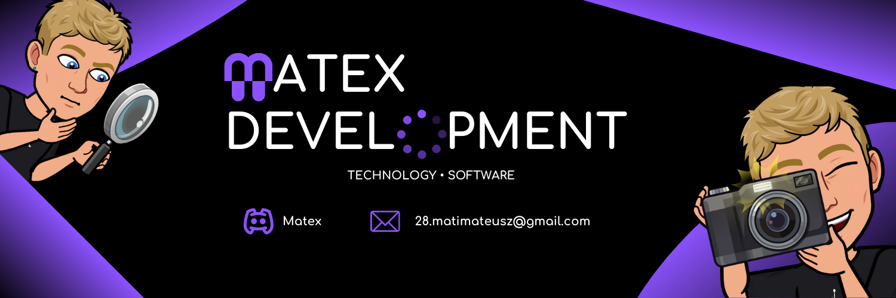

 

# Hi! I'm Matex

I am a young programmer attending high school. I like taking on programming challenges and I like learning new technologies and languages. 

If you have any questions please contact me.

---

## 💻 Technologies  

            -000020?style=for-the-badge&logo=react&logoColor=61DAFB)   
          

---

## ☎️ Contact  

- 📧 **E-Mail**: [28.matimateusz@gmail.com](mailto:28.matimateusz@gmail.com)  
- 🎮 **Discord**: Matex 

---

## 📈 GitHub Stats 

---

🔗 **Feel free to connect with me and explore my work.**
